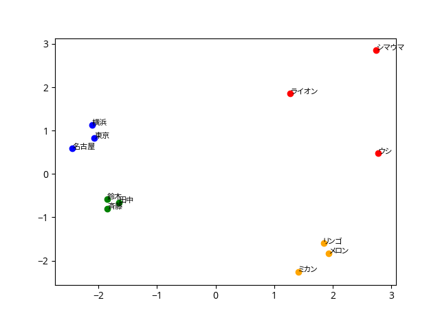

kmeans を使った単語のクラスタリングと可視化
====

kmean による単語のクラスタリングを実行をするためのスクリプトです。  
同時に、主成分分析により特徴ベクトルを2次元に削減し、プロットすることで可視化をおこないます。

## Description
単語ベクトルを kmeans にかけることによって、単語のクラスタリングを行います。  
単語から単語ベクトルを算出するための学習データは、[こちら](https://qiita.com/Hironsan/items/513b9f93752ecee9e670)で公開されている fastText の学習済みモデルをバイナリ化したものを用いています。

## Demo
["斉藤", "リンゴ", "シマウマ", "東京", "ライオン", "名古屋", "ミカン", "ウシ", "メロン", "田中", "横浜", "鈴木"]  
を `k = 4` でクラスタリングした結果は以下のようになります。  

## Requirement
- Python3 or more

## Usage
`python3 words_kmeans_cluster.py `  

## Extension
単語をファイルから読み込みたい場合や、kの数を入力によって変更したい場合は適宜プログラムを変更して下さい。  
クラスタリングの対象となる単語はプログラム中の `vocab` に、kの値は `n_clusters` に代入して下さい。

## Author

[nekunet](https://github.com/nekunet)
